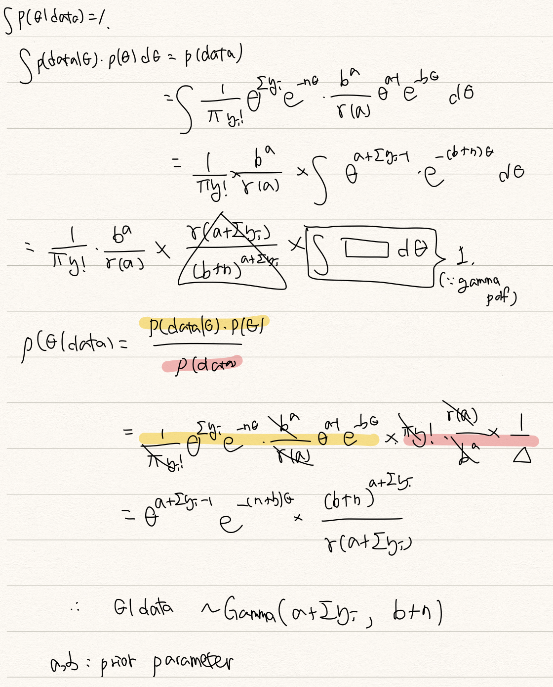

# One Parameter Model

### Binomial distribution

$$
Y_i|\theta \sim Ber(\theta)  \\  
\Sigma^n_{i=1}Y_i|\theta \sim Binom(n,\theta) \\
\theta \sim Beta(a,b)
$$

$$
\theta|data \sim Beta(a+\Sigma^n_{i=1}y_i, b+n-\Sigma^n_{y=1}y_i) 
\\ \tilde{y}|\theta \sim Ber(\theta)
\\ \tilde{y}|data \sim Ber(\dfrac{a+\Sigma^n_{i=1}y_i}{a+b+n})
$$

|           | Success        | Fail             | Number  | $$\theta$$ |
| --------- | -------------- | ---------------- | ------- | ---------- |
| belief    | $$a$$          | $$b$$            | $$a+b$$ |            |
| data      | $$\Sigma y$$   | $$n-\Sigma y$$   | n       |            |
| posterior | $$a+\Sigma y$$ | $$b+n-\Sigma y$$ |         |            |

### Poisson Distribution

📖 There is a book with N pages.&#x20;

$$Y_i : Number  \;of\;typo \;in\;\mathbf{i}th\;page$$, the type in whole pages becomes $$\Sigma Y_i$$

When we assume $$E(Y_i)=2$$, let $$\theta$$be the number of typo per page.

$$
\theta = \dfrac{\Sigma Y_i}{N} \\
Y_i|\theta \sim Poi(\theta) \\
\Sigma Y_i|\theta \sim Poi(n\theta)
$$

The sum of Y follows poisson distribution, because the typos per page are independent with i.i.d. assumption. We can assume theta follow this distribution(prior):

$$
\theta \sim Gamma(a,b) \\
\theta | data \sim Gamma(a+\Sigma y_i, b+n)
$$

$$\theta|data$$ follows gamma distribution as a following proof.

&#x20;We find prior and posterior distribution, so we can make a bayesian poisson model.

|           | Typo           | Page    | Typo per page   |
| --------- | -------------- | ------- | --------------- |
| Prior     | $$a$$          | $$b$$   | $$a/b$$         |
| Data      | $$\Sigma y$$   | $$n$$   | $$\Sigma y /n$$ |
| Posterior | $$a+\Sigma y$$ | $$b+n$$ |                 |

* $$a+\Sigma y$$: The number of typo we already knew.
* $$b+n$$: The number of pages we already knew.

&#x20;**1) What is the expected typo error per page? - Posterior Moments**

$$
\theta|data \sim Gamma(a+\Sigma y_i, b+n) \\
\mu = \dfrac{a+\Sigma y_i}{b+n}=\dfrac{b}{b+n}\dfrac{a}{b}+\dfrac{n}{b+n}\dfrac{\Sigma y_i}{n} \\ 
\\↩︎\\
\sigma^2 = \dfrac{a+\Sigma y_i}{(b+n)^2}
$$

The weighted average between prior information and data information becomes the mean of gamma distribution.

&#x20;**2) What is the distribution of new observation? - Posterior Prediction**

$$
\tilde{Y}|data \sim NB(a+\Sigma y_i,p), \; p=\dfrac{1}{b+n+1} \\
$$

It is followed by this proof.

$$
p(\tilde{y}|data) =  p(\tilde{y},\theta|data)d(\theta) \\ =  \int p(\tilde{y}|\theta,data)p(\theta|data)d(\theta)=\int p(\tilde{y}|\theta)p(\theta|data)d(\theta) \\
\tilde{Y}|\theta \sim Poi(\theta)
$$

&#x20;The likelihood of new observation is same to one of data.

NB(Negative Binomial)  is the number of success until **r**th failure with p success rate. Before we failure with the number of$$a+\Sigma y_i$$, $$\tilde{Y}$$means the number of success. This success means the typo takes place at new page.

&#x20;We can also derive mean and variance using Posterior predictive. However when it comes to poisson modeling, there is a disadvantage that data becomes overdispersion. It is because the variance of data is much bigger than theta. In this case we can use NB model or Hierarchical Normal model.

### Exponential Families

$$
\begin{equation}
 f(x;\theta)=\begin{cases}
    exp[p(\theta)K(x)+s(x)+q(\theta)], & x\in S. \\
    0, & \text{otherwise}.
  \end{cases}
\end{equation}
$$

Under the conditions as follows:

1. S does not depend on $$\theta$$
2. &#x20;$$p(\theta)$$ is a nontrivial continuous function of $$\theta \in \Omega$$
3. If X is continuous, $$K'(x) \neq 0$$and s(x) is continuous function. If X is discrete, $$K(x)$$is nontrivial function

$$
\begin{equation}
 f(y|\phi)=\begin{cases}
    h(y)c(\phi)exp[\phi K(y)], & x\in S. \\
    0, & \text{otherwise}.
  \end{cases}
\end{equation}
$$

Under the conditions as follows:

1. S does not depend on $$\theta$$
2. $$\phi$$ is a nontrivial continuous function of $$\theta \in \Omega$$
3. If Y is continuous, $$K'(y) \neq 0$$and h(y) is continuous function. If Y is discrete, $$K(y)$$is nontrivial function

&#x20;If probability density/mass function is expressed above, it means that the probability distribution belongs to an exponential family. Well-known distributions are usually included in exponential family.

### Sufficient statistic for theta

* $$Y_1=u_1(X_1,\cdots,X_n)$$is sufficient statistic for theta.&#x20;
* &#x20;$$p(X_1,X_2,\cdots,X_n|Y_1=y_1)$$doesn't contain theta(parameter.)
* Our statistic fully explains our parameters.
* $$X_1,\cdots,X_n \sim iid ; f(x;\theta)$$ If f is exponential family, then $$K(x)=\Sigma K(x_i)$$is sufficient statistic for theta

These 4 sentences are in equivalence relation.

> If the posterior distribution $$p(\theta|x)$$ are in the same probability distribution family as the prior probability distribution $$p(\theta)$$, the prior and posterior are then called conjugate distributions. (by wikipedia)

$$
f(y_1,\dots,y_n|\phi)=\Pi h(y_i)c(\phi)e^{\pi K(y_i)} \propto c(\phi)^ne^{\phi \Sigma K(y_i)} \\ p(\phi)=k(n_o,t_0)c(\phi)^{n_0}e^{n_0t_0\phi}
\propto c(\phi)^{n_0}e^{n_0 t_0 \phi} \\ p(\phi|y) \propto p(\phi)f(y|\phi) 
\propto c(\phi)^{n_0+n}exp[\phi(n_0t_0+n\frac{\Sigma K(y_i)}{n})]
$$

Which has the same with prior.

### &#x20;

